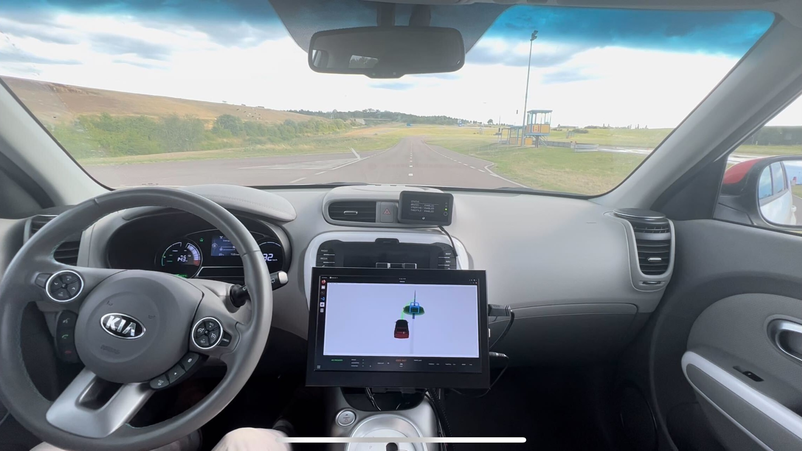

# MPPI Motion Planning

Implementation of an MPPI based motion planner for autonomous driving. This code was used for the paper "Towards a Safe Real-Time Motion Planning Framework for Autonomous Driving Systems: An MPPI Approach".



## Experiments Video
See [mppi.mp4](./mppi.mp4).

## Citation
If you find this work useful or relevant for your research, please cite our paper:
```bibtex
@article{testouri2023towards,
  title={Towards a Safe Real-Time Motion Planning Framework for Autonomous Driving Systems: An MPPI Approach},
  author={Testouri, Mehdi and Elghazaly, Gamal and Frank, Raphael},
  journal={arXiv preprint arXiv:2308.01654},
  year={2023}
}
```

## License
See [LICENSE](./LICENSE.txt).
